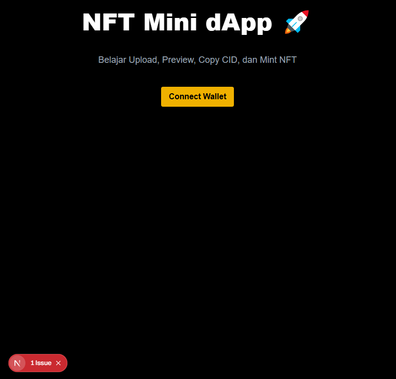

# 🚀 NFT Mini dApp

A simple and clean Web3 NFT dApp that allows users to upload images to IPFS, preview CID, connect wallet, and mint NFTs — all in a single page.

---

## 🖼️ Screenshot



---

## ✨ Features

- 🔗 Connect Wallet (MetaMask + Wagmi + RainbowKit)
- 📤 Upload image to IPFS (Pinata / Web3Storage ready)
- 🖼️ Live image preview before uploading
- 📋 CID preview + copy button
- 🪙 Mint NFT to deployed smart contract (Sepolia)
- ⚡ Fully Single-Page UX — simple, fast, and user-friendly
- 🧱 Built with modern Next.js App Router

---

## 📁 Project Structure

```text
nft-mini-dapp/
├── .env.local
├── .gitignore
├── .next/
├── artifacts/
├── cache/
├── contracts/
├── eslint.config.mjs
├── hardhat.config.js
├── ignition/
├── next-env.d.ts
├── next.config.ts
├── node_modules/
├── package-lock.json
├── package.json
├── postcss.config.mjs
├── public/
├── README.md
├── screnshoots.PNG
├── scripts/
├── src/
│   ├── app/
│   │   ├── favicon.ico
│   │   ├── globals.css
│   │   ├── layout.tsx
│   │   ├── page.tsx
│   │   ├── mint/page.tsx
│   │   └── upload/page.tsx
│   ├── components/
│   │   ├── NFTUploader.tsx
│   │   └── WalletConnect.tsx
│   └── lib/
│       └── wagmi.ts
├── test/
├── tsconfig.json
└── types/


🛠️ Getting Started
1️⃣ Install dependencies
npm install

2️⃣ Run development server
npm run dev


Open in browser:
👉 http://localhost:3000

🔧 Deploying the Smart Contract

Using Hardhat:

npx hardhat run scripts/deploy.ts --network sepolia


Save:

Contract Address

ABI folder (artifacts)

🧪 Tech Stack

Next.js 14 (App Router)

React 19

TailwindCSS

Wagmi + Viem

RainbowKit

Alchemy / Infura

Pinata / Web3Storage

Hardhat

📦 Build for Production
npm run build
npm run start